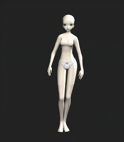
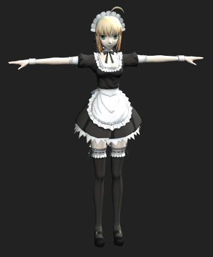
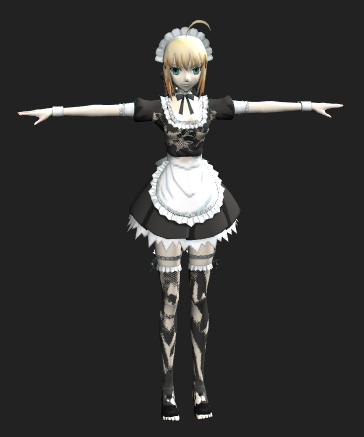
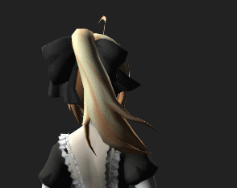
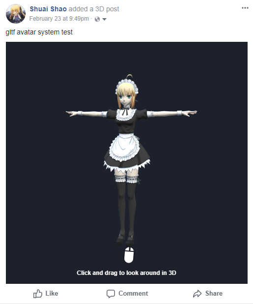
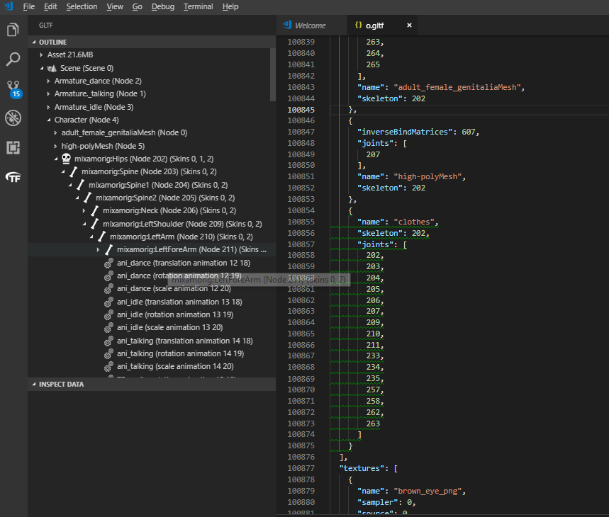

# gltf-avatar-threejs loader, viewer, exporter

### [Live Demo](https://shrekshao.github.io/gltf-avatar-threejs/)

## Brief feature intro

A dynamic avatar system based on glTF which supports: 

- [x] switchable skin (clothes, hair, accessory) sharing a skeleton
- [x] pixel-granuality skin visibility control
    - [x] threejs real time render
    - [x] bake to merged glTF/glb
- [x] sub-skeleton and animations in skin file (hair skeleton, face expression rigging)
- [x] node rigid bind
- [x] merge and output as valid standard glTF (without need for extension support loader)
    - [x] nodejs
    - [x] browser export glb
- [ ] TODO: hair, clothes physics (MMD?)


## Feature examples

* combination of skins with shared skeleton or rigid bind



* visibility control of skin, in real time renderer or baked

| with visibility control | without visibility control |
|-------------------------|----------------------------|
|     |     |

* sub skeleton and animation ins skin (hair) file



* mixamo animation

* merge and export as glb, able to get loaded on facebook, sketchfab, Godot, ...




## glTF Avatar Spec v0.2

### Skeleton (Base / Main / Character) file

* An example of glTF avatar features in a skeleton file

```json
{
    "extensionsUsed": [
        "gl_avatar"
    ],
    "extensions": {
        "gl_avatar": {
            "type": "skeleton",
            "skins": {
                "main": 2
            },
            "nodes": {
                "head": 8,
                "head-end": 9
            }
        }
    },
    "materials": [
        {
            "name": "saber-pure-body",
            "...": "...",
            "extensions": {
                "gl_avatar": {
                    "bodyIdLUT": 2
                }
            }
        },
        "..."
    ],
    "nodes": [
        {
            "mesh": 0,
            "name": "F010_Saber_Body",
            "skin": 0,
            "extensions": {
                "gl_avatar": {
                    "skin": 2
                }
            }
        },
        "..."
    ],
    "...": "..."
}
```
* `extensions.gl_avatar`
    - `type`: `skeleton` or `skin`. Theoretically `skeleton` file can contain no mesh but only joints. However usually glTF exporters will ignore joints not used by any skinned mesh. So does the threejs glTF loader. So the literal skin of a character is ususally included in a `skeleton` file. We currently recommend standard 65 joints from mixamo as the general skeleton for the character.
    - `skin`: a dictionary mapping skeleton name to skin id. Other clothes files will use skeleton name to reference a joint list of the skeleton file.
    - `nodes`: a dictionary mapping node name to node id. Similiar to the skin map. This can be used by sub-skeleton or rigid bind, that needs to attach to certain node as a child.
* `materials[i].extensions.gl_avatar.bodyIdLUT` : bodyIdLUT is the texture id of a body id look up table texture. This texture is now a normal png file. Of which the red channel value indicates the body id.
* `node[i].extensions.gl_avatar.skin` : this is used for threejs gltf loader to pick up this skin, if this skin is not used by this skeleton file


### Skin (Clothes / Accessory) file


* An example of glTF avatar features in a skin file

```json
{
    "extensionsUsed": [
        "gl_avatar"
    ],
    "extensions": {
        "gl_avatar": {
            "visibility": [
                0, 
                1, 1, 1, 0, 0, 
                0, 0, 1, 1, 1, 
                1, 1, 1, 1, 1,
                1, 1, 1, 1, 1,
                1, 1, 1, 0, 0,
                0, 0, 0, 0, 0,
                0, 0, 0, 1, 1,
                0, 0, 1, 1, 1,
                0, 0, 0, 0, 0,
                0, 0, 0, 0, 0,
                0, 0, 0, 0, 0,
                0, 0, 0, 0
            ],
            "type": "skin",
            "linkedSkeletons": [
                {
                    "inverseBindMatrices": 174,
                    "name": "Saber_maid_dress",
                    "skeleton": "main"
                }
            ]
        }
    },
    "meshes": [
        {
            "name": "F010_Saber.003",
            "primitives": [
                {
                    "...": "...",
                    "extensions": {
                        "gl_avatar": {
                            "attributes": {
                                "JOINTS_0": 159,
                                "WEIGHTS_0": 173
                            }
                        }
                    }
                }
            ]
        }
    ],
    "nodes": [
        {
            "name": "Saber_maid_dress",
            "...": "...",
            "extensions": {
                "gl_avatar": {
                    "skin": 0
                }
            }
        },
        {
            "name": "Hair_bone",
            "...": "...",
            "extensions": {
                "gl_avatar": {
                    "root": "head-end"
                }
            }
        }
    ],
    "...": "..."
}
```

* `extensions.gl_avatar`
    - `type`: `skeleton` or `skin`. 
    - `visibility`: It's an array of visiblity status of this clothes. `0` means invisible for this body id. For real time renderer, this visibility array will be sent to gpu via a texture or a uniform buffer. The shader of the main character skeleton will discard fragments whose `visibility[bodyId] == 0`. For baked glTF file, this array will affect the output texture of main character skeleton. Those fragments with `visibility[bodyId] == 0` will have a zero alpha channel. With `alphaMode` set to `MASK` and a `alphaCutoff` of 0.5, these fragments on the character skin will be invisible.
    - `linkedSkin`: corresponds to the shared skins in `skeleton` file.
* `meshes[i].primitives[i].extensions.gl_avatar.attributes`: store `JOINT` and `WEIGHT` of skinnedmesh here.
* `nodes[i].extensions.gl_avatar.skin`: refers to skin id in `extensions.gl_avatar.linkedSkin`.
* `nodes[i].extensions.gl_avatar.root`: rigid-bind/sub-skeleton


## Blender art asset tutorial

Thanks @zen85 for pushing me forward to finish this part (which should be done at very first but I was too lazy... -_-). 

gltf exporter we use: https://github.com/Kupoman/blendergltf (master)

### Prepare the base skeleton glTF file

* First you should have a base skeleton rigged in blender in T-pose. Save a separate file (We will call it `base.blend` later) for this before adding any animations. You will use this file to rig other skins (clothing, hair, shoes, etc.)
    * We do this because if you rig your clothing (`skin`) in a blender file with animation. Your clothing file will contains animation data, which is not we want. (You could still get rid of animation by delete animations and their orphan data though https://blender.stackexchange.com/questions/36129/can-not-delete-actions-in-action-editor-even-with-shift-x/38718). Also seems that exporting base skeleton with other rigged mesh in blender file would be problematic with the gltf exporter plugin I'm using.
* To have skin visibility control, you need to have an extra texture called body id map, which labels an id number in R channel (0-255) for each part of the skeleton mesh. You can generate this by texture painting in blender, or export uv snapshot and paint in Photoshop, GIMP etc.
* To add animation and export, you can follow the awesome tutorial by @donmccurdy: https://www.donmccurdy.com/2017/11/06/creating-animated-gltf-characters-with-mixamo-and-blender/
* At this point you should have an exported glTF base skeleton with animations. It will be in a folder, together with `.bin` and texture images (We will call it `skeleton.gltf`).
* Run `node tools/glavatar-pipeline.js path/to/skeleton.gltf --skeleton -o path/to/skeleton-avatar.gltf` (This tool is crappy and needs handcraft at this moment... Sorry. Consider using https://github.com/Microsoft/glTF-SDK in the future)
    * Replace `skeleton.gltf` with `skeleton-avatar.gltf` (Save a copy of original)
    * TODO: handcraft visibility information

### Prepare the clothing (skin) glTF file

* Rig your clothes in `base.blend`.
* Export as gltf (We will call it `clothing.gltf`).
* Run `node tools/glavatar-pipeline.js path/to/clothing.gltf --skin -o path/to/clothing-avatar.gltf`
    * Replace `clothing.gltf` with `clothing-avatar.gltf` (Save a copy of original)
* Handcraft (Sorry):
    * Copy the `{...}` under `extensions.gl_avatar.linkedSkeletons` into `skeleton-avatar.gltf`, inside `skins` array.
        * This is because blender and the exporter only write joints that has non-zero weight of cur mesh. So the skeletons could be different even you have only one set of bones.
        * The node id could be different as well. Usually it will just be an offset for every node id under `joints`
        * VScode gltf debug plugin by microsoft is highly recommended
            * 
    * `TODO`


## Credit

* [makeglb](https://github.com/sbtron/makeglb) by @sbtron